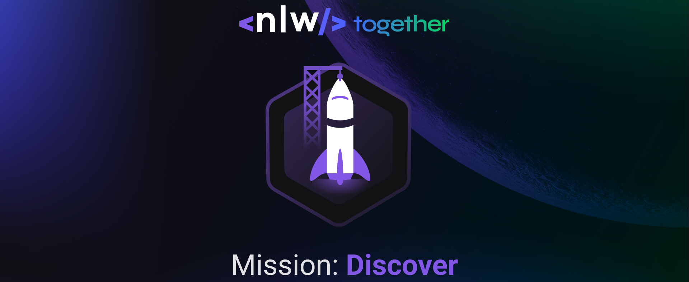

<h1 align="center">NLW Together 👨‍🚀🚀</h1>
 
A [NLW together](https://nextlevelweek.com/pre-nlw) ocorreu entre os dias 20 e 27 de junho, e a trilha que escolhi foi a *Mission: Discover Foundation*,
que teve como foco o aprimoramento dos fundamentos da programação. 📚
  

  

 

<h2 >Rocket.Q</h2>

O Rocket.Q é uma aplicação de interação através de perguntas, sendo possível criar uma sala para internautas anônimos fazerem perguntas
e o criador da sala em posse de uma senha gerenciar essas perguntas e marcar como lidas.

  

 

<h2>📋 Sumário</h2>

- [Sobre](#rocketq)
- [Tecnologias](#technologies)
- [Layout](#layout)
- [Licença](#license) 

 

<h2>💡 Tecnologias Utilizadas</h2>

As seguintes tecnologias foram utilizadas no desenvolvimento do projeto:

- HTML5
- CSS3
- JavaScript
- NodeJS
- EJS
- Express
- SQLite

 

<h2>🔖 Layout</h2>

Você pode visualizar o layout do projeto através [desse link](https://www.figma.com/file/vp3iFfd1ohCbHyDX9jCiQi/Roquet.q). É necessário ter conta no [Figma](https://figma.com) para acessá-lo.

 

<h2>📝 Licença</h2>

Esse projeto está sob a licença MIT. Veja o arquivo [LICENSE](LICENSE) para mais detalhes.
